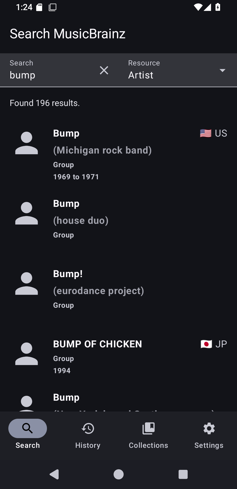
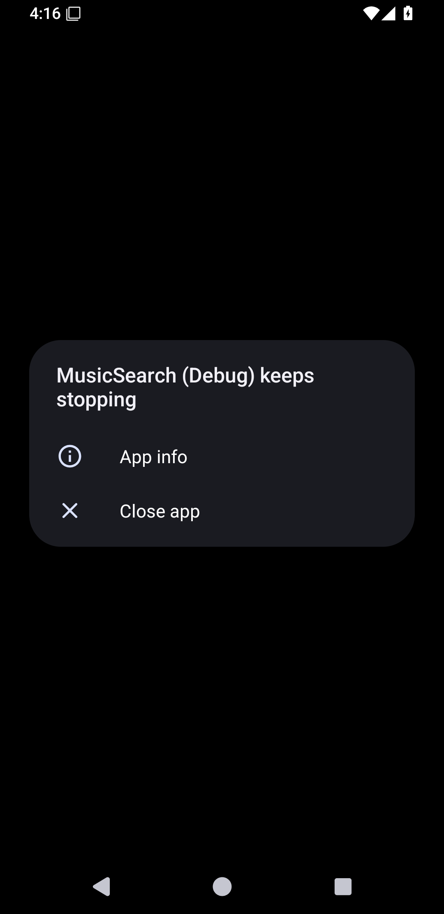
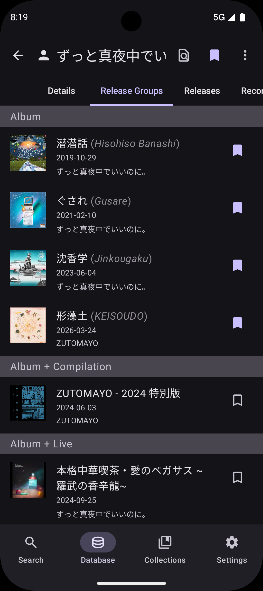
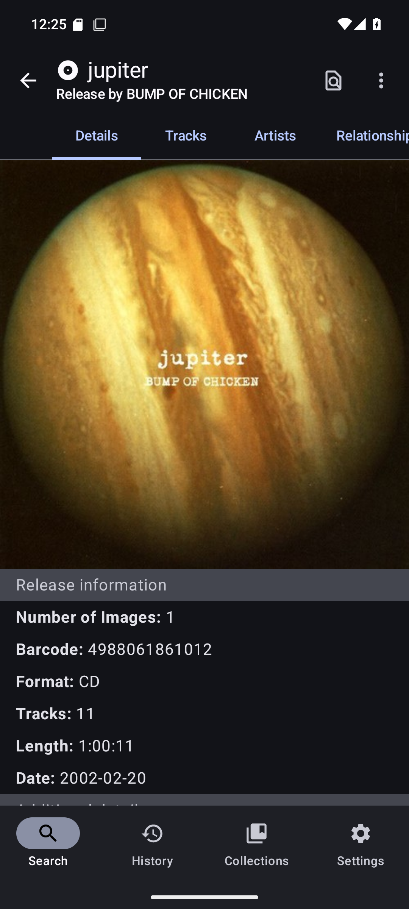
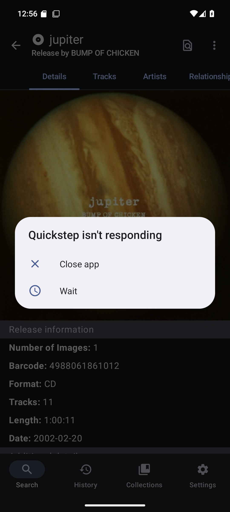
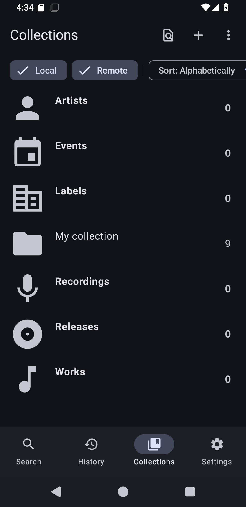
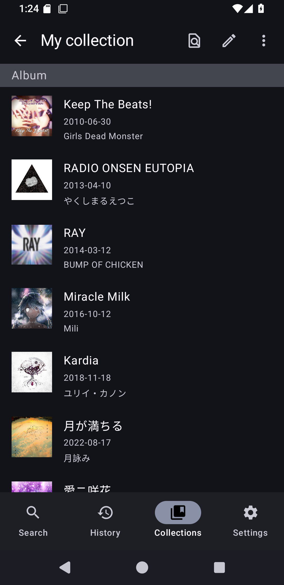
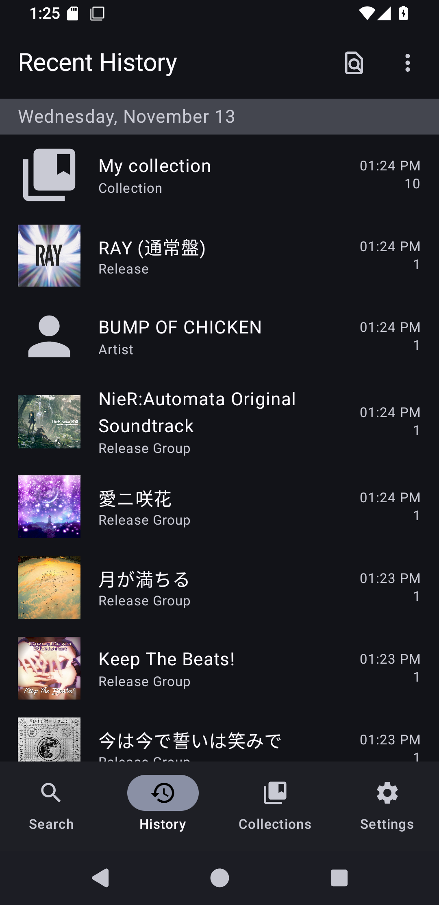

# MusicSearch

    
    
    

An Android app for browsing songs, artists, and anything related to them
using [MusicBrainz's API](https://wiki.musicbrainz.org/MusicBrainz_API).

Multiplatform distributions are heavily WIP. Only the Android app is considered stable.

## Releases

Or you can you can download its APK from the top of [all GitHub Releases](https://github.com/lydavid/MusicSearch/releases/).

Desktop releases are packaged by [Conveyor](https://www.hydraulic.dev/) and available from this [download page](https://lydavid.github.io/MusicSearch/download.html).

## Features

- Search MusicBrainz's massive database for any information related to your favorite artist or song
- Offline-first; all data is cached on device after loading each page/tab
- See every page you've visited in the history screen, and quickly get back to them
- Almost every tab allows you to filter its content instantaneously
- Save anything to a collection
- Login using your MusicBrainz account to add to your existing collections
- Listening on Spotify? Enable Device Broadcast Status to search the artist or song from the app
- Have a Pixel phone? Enable notification listener to record Now Playing history
- Dark theme
- Material You theme

See [all features here](./docs/all_features.md).

## Screenshots

| Search artist                             | Artist details                             | Release groups by artist                          | Release details                             |
|-------------------------------------------|--------------------------------------------|---------------------------------------------------|---------------------------------------------|
|  |  |  |  | 

| Release tracks                             | All collections                             | Collection of releases                 | Lookup history                             |
|--------------------------------------------|---------------------------------------------|----------------------------------------|--------------------------------------------|
|  |  |  |  |

## Development

[See here](./docs/README.md) for notes on setting up the project, and some development processes.

## Privacy Policy

See [PRIVACY_POLICY.md](PRIVACY_POLICY.md)
