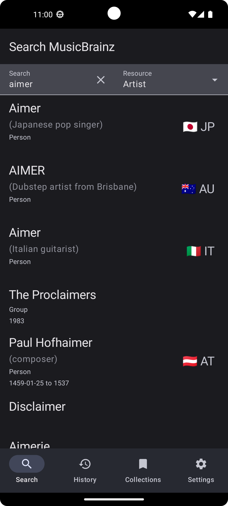
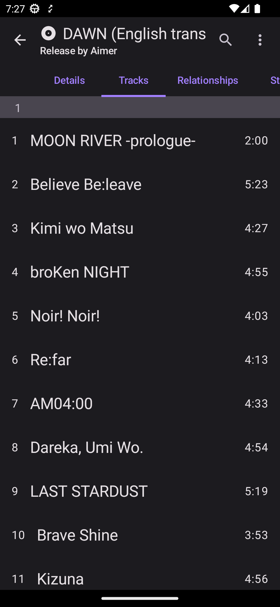
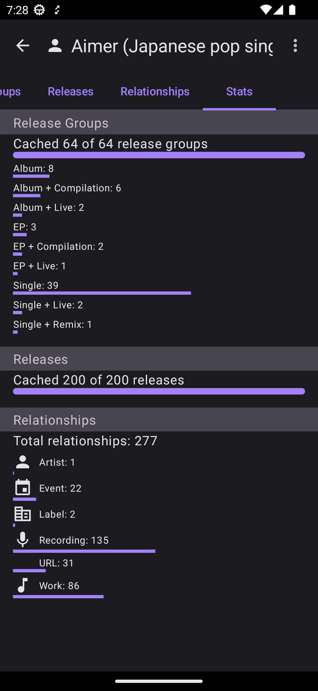
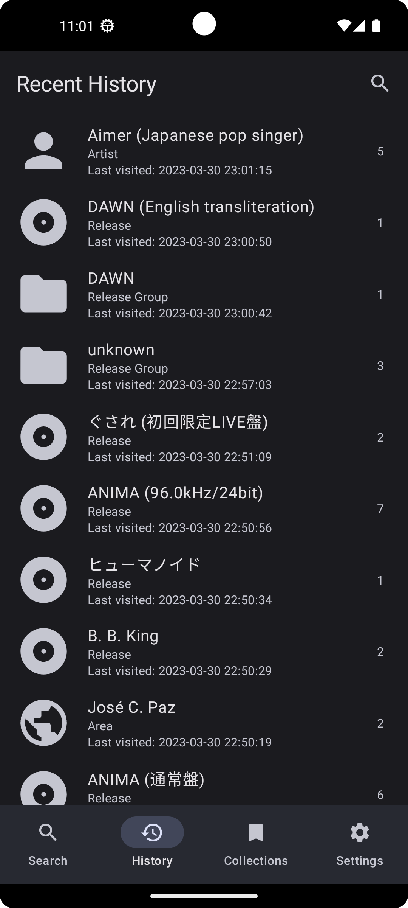
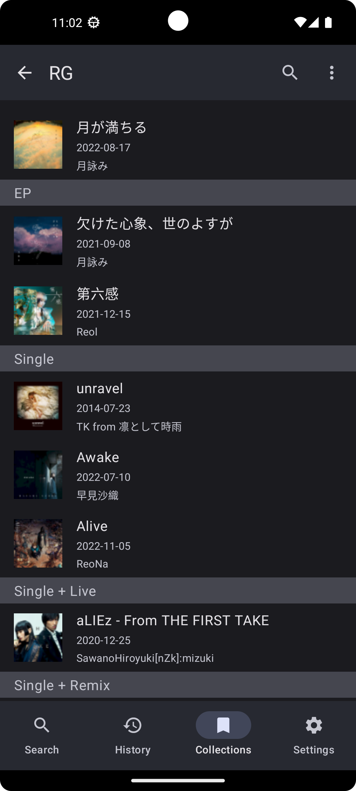
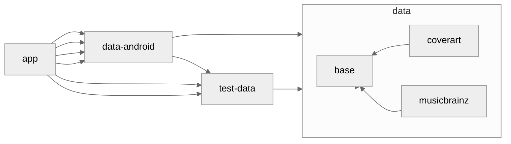

# MusicSearch

An Android app for browsing songs, artists, and anything related to them
using [MusicBrainz's API](https://wiki.musicbrainz.org/MusicBrainz_API).

## Features

- Search MusicBrainz's massive database for any information related to your favorite artist or song
- All data is cached on device after loading each page/tab
- History: See every page you've visited, and quickly get back to them
- Filter: Almost every tab allows you to search its content instantaneously
- Collections: Save anything to a collection
- Login using your MusicBrainz account to add to your existing collections
- Cover arts
- Dark theme
- Material You theme

## Screenshots

| Search artist       | Release groups by artist   | Release details     | Release tracks      |
|---------------------|----------------------------|---------------------|---------------------|
|    |           |    |    | 

| Artist stats      | Lookup history    | Collection of release groups |
|-------------------|-------------------|------------------------------|
|  |  |             |

## Development

[See here](./docs/README.md) for notes on upcoming features and some development processes.

## Privacy Policy

See [PRIVACY_POLICY.md](PRIVACY_POLICY.md)

## Dependency Diagram

