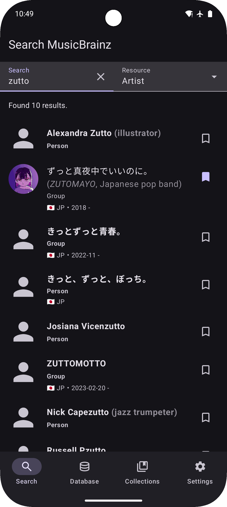
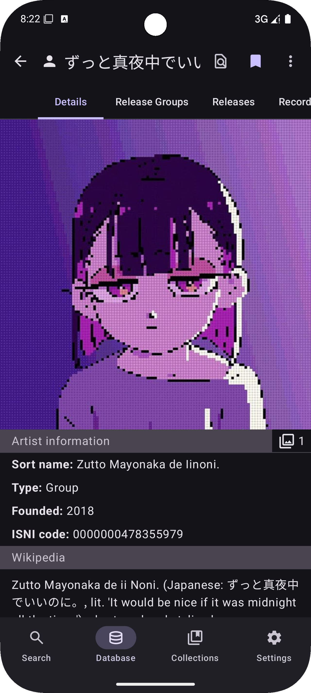
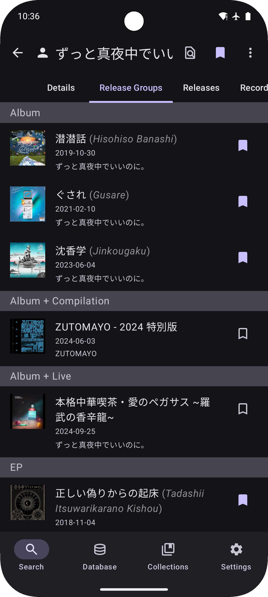
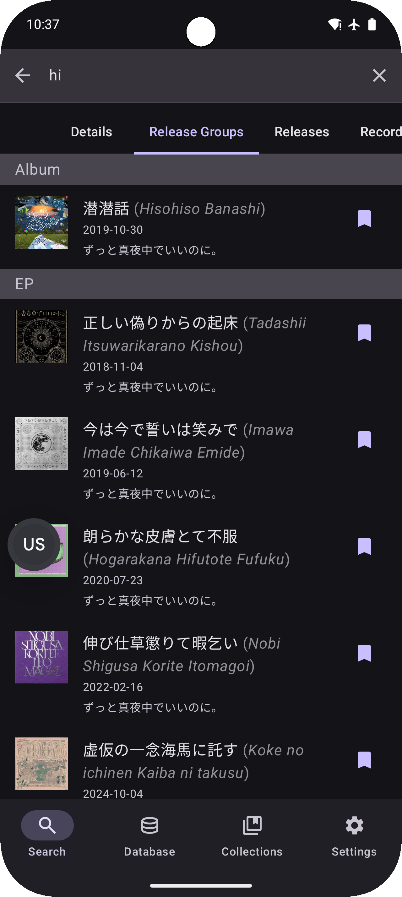
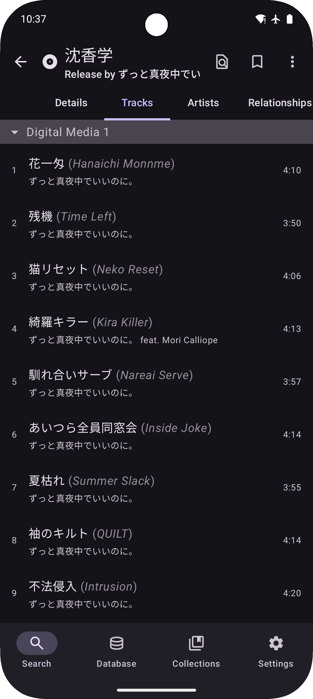
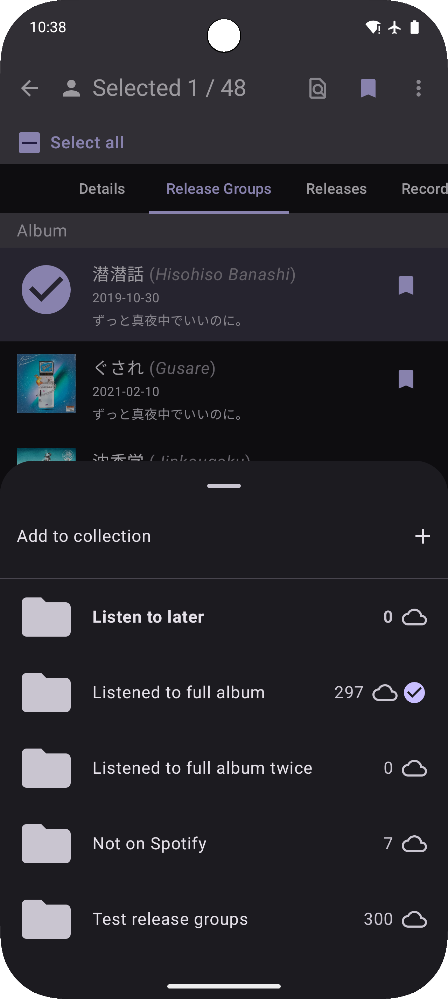

# MusicSearch

    
    
    

An Android app for browsing songs, artists, and anything related to them
using [MusicBrainz's API](https://wiki.musicbrainz.org/MusicBrainz_API).

Multiplatform distributions are heavily WIP. Only the Android app is considered stable.

## Releases

Or you can download its APK from the top of [all GitHub Releases](https://github.com/lydavid/MusicSearch/releases/).

Desktop releases are packaged by [Conveyor](https://www.hydraulic.dev/) and available from this [download page](https://lydavid.github.io/MusicSearch/download.html).

## Features

- Search MusicBrainz's massive database for any information related to your favorite artist or song
- Offline-first; all data is cached on device after loading each page/tab
- Almost every tab allows you to filter its content instantaneously
- Aliases will be used when filtering to help find things in other languages
- See every page you've visited in the history screen, and quickly get back to them
- Save anything to a collection
- Login using your MusicBrainz account to add to your existing collections
- Listening on Spotify? Enable Device Broadcast Status to search the artist or song from the app
- Have a Pixel phone? Enable notification listener to record Now Playing history
- Scrobbling to ListenBrainz? Enter your username to explore your listens
- Customize the app's appearance with: Light/Dark theme, Material theme based on your wallpaper, or pick a custom color
- Is an artist's discography incomplete? Aliases missing? Other data missing? Contribute it to MusicBrainz: https://musicbrainz.org

See [all features here](./docs/all_features.md).

This is a music database/discovery app, not a music player.
There are external links to various streaming platforms which will open the album/song in their app if it's installed.

## Screenshots

| Search artist                                                                    | Artist details                                                                    | Release groups by artist                                                                 | Release groups by artist (filtered)                                                             |
|----------------------------------------------------------------------------------|-----------------------------------------------------------------------------------|------------------------------------------------------------------------------------------|-------------------------------------------------------------------------------------------------|
|  |  |  |  | 

| Release details                                                                    | Release tracks                                                                    | All collections                                                                    | Collection management                                                                    |
|------------------------------------------------------------------------------------|-----------------------------------------------------------------------------------|------------------------------------------------------------------------------------|------------------------------------------------------------------------------------------|
|  |  |  |  |

## Development

[See here](./docs/README.md) for notes on setting up the project, and some development processes.

You can help translate this project through Weblate by clicking this [link](https://hosted.weblate.org/engage/musicsearch/) or the image below:

## Privacy Policy

See [PRIVACY_POLICY.md](PRIVACY_POLICY.md) for Android and Desktop.
See [PRIVACY_POLICY_IOS.md](PRIVACY_POLICY_IOS.md) for iOS.
