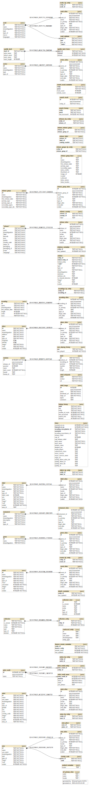

# Documentation

A place to document my development, testing, and release processes.

## Development

- [Setup](./development/setup.md)
- [Tips and Tricks](./development/tips.md)
- [Common links I keep referencing](./development/common_links.md)
- [Naming conventions](./development/naming_conventions.md)
- [Visualize database](./development/visualize_database.md)

## Testing

- [Test commands and deep links](./testing/test_commands_and_deep_links.md)

## Release

- [Automated Nightly Release](./release/automated_beta_release.md)
- [Production Release](./release/production_release.md)
- [Build secrets](release/build_secrets.md)

## Dev Journal

- [Switch from Navigation Drawer to Bottom Navigation Bar](./journal/2023-02-21_drawer_to_bottom_nav.md)
- [OAuth 2 with MusicBrainz](./journal/2023-03-05_oauth_musicbrainz.md)
- [Release merge problem (v0.13.0)](./journal/2023-07-30_release_merge_problem.md)
- [Key](./journal/2023-09-26_key.md)
- [Unicode](./journal/2023-10-02_unicode.md)
- [Compose Stability](./journal/2023-10-03_compose_stability.md)
- [Paging](./journal/2023-10-14_paging.md)
- [Attempting OAuth 2.0 for a JVM Desktop App](./journal/2023-10-20_oauth_jvm_desktop.md)
- [Local MusicBrainz](./journal/2023-12-10_local_musicbrainz.md)

## Database schema

The core entities in our database should match closely to that of MusicBrainz ([see their schema](https://musicbrainz.org/doc/MusicBrainz_Database/Schema)).

One major difference is the lack of foreign key (FK) constraints between many of our entities.
This is intentional so that a user may start browsing an entity from any other entities without us having to download every related data to fulfill the FK constraint.
In some situations, it is not feasible to do so.
Such as when we are paging a list of entities.
We do not want to have to make additional API calls to fulfill their FK constraints.

