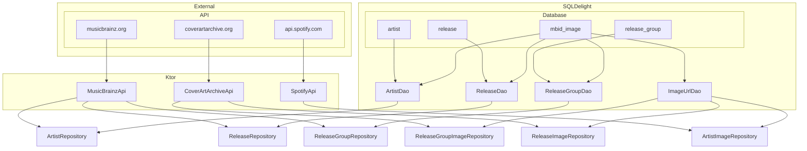
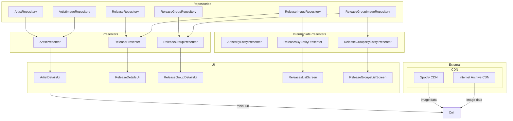

# Images

This shows the data flow for image url and data.

Image urls are stored in their own table `mbid_image`.
When we query an entity from their entity table (e.g. `release`, we join it with this table.

If there were no entries in `mbid_image` for a given `mbid`, a `*ImageRepository` would request for it,
then store it, so that the next time we query our database, we will have it.

Given a url, Coil will fetch the image data from a CDN and render it.

`mbid` is used as `memoryCacheKey` and `placeholderMemoryCacheKey`, 
allowing us to reuse the thumbnail as a placeholder while Coil fetches the full-sized image. 

`*DetailsUi` displays a full-sized image given a `*ScaffoldModel`.
`*ListScreen` displays a thumbnail image for each `*ListItemModel`.
